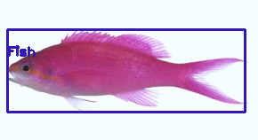
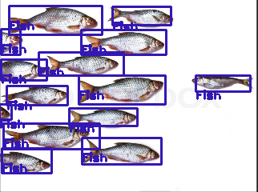
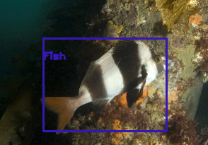
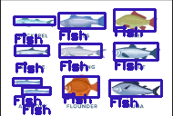
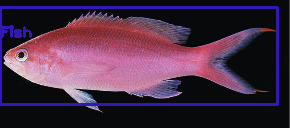
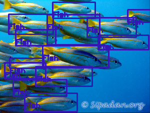

# Deep Learning: Detecting Fishes using YOLO Algorithm

In this deep learning project, we are using the You-only-look-once(Yolo) algorithm to detect fishes in image files. Using yolo v3.0, we can use a trained model to mark the outline of the fishes in any image. This can be implemented in real-time situations efficiently.

## Getting Started

* Save the required images on which the model needs to run in [image](https://github.com/tanush-r/fish-detection-yolo/tree/main/image).
* Run [yolo_object_detection.py](https://github.com/tanush-r/fish-detection-yolo/blob/main/yolo_object_detection.py) to load the model.
* The program will return the images with the outlines and save it in [result](https://github.com/tanush-r/fish-detection-yolo/tree/main/result).

## Results

## Built With

* [VSCode](https://code.visualstudio.com/) - IDE used
* [YOLOv3-Darknet](https://github.com/mdv3101/darknet-yolov3) - Neural Network for algorithm

## Authors

* **Tanush R** - [tanush-r](https://github.com/tanush-r)

